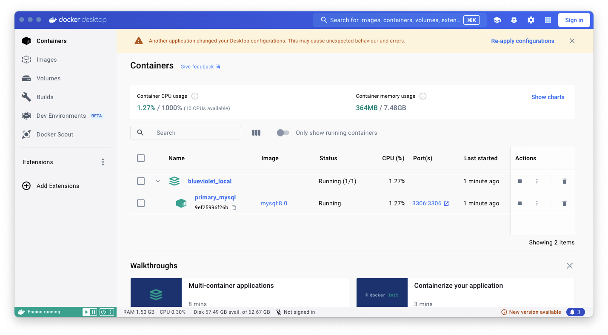

# Blueviolet - Backend

## 1. 프로젝트 소개

* 온라인 쇼핑몰의 기본 기능 구현에 집중하여 웹 애플리케이션 개발을 진행한 프로젝트입니다.

## 2. 사용 기술

* `Java 17`

* `Gradle`

* `Spring Boot 3.2.3`

* `Spring Web`

* `Spring Data JPA`

* `Querydsl`

* `MySQL`

* `Docker`

## 3. 실행에 필요한 환경 구성
> 아래 과정은 도커 (Docker)가 설치되었다는 가정하에 진행됩니다.

* ① 터미널에서 아래 명령어를 입력하여 리포지토리를 로컬 환경에 다운로드 받습니다.

    ```
    git clone https://github.com/alliwannadev/blueviolet-backend.git
    ```

* ② `blueviolet-backend` 디렉토리로 이동합니다.

    ```
    cd blueviolet-backend
    ```

* ③ 이어서 `docker/local` 디렉토리로 이동합니다.

    ```
    cd docker/local
    ```

* ④ `reset.sh` 파일을 실행합니다.

    ```
    ./reset.sh
    ```

* ⑤ 도커 데스크톱을 확인 해보면 다음과 같이 정상적으로 컨테이너가 구동 중인 것을 확인할 수 있습니다. 

  

## 4. 실행 방법
> 아래 과정을 진행하기 전에 "3. 실행에 필요한 환경 구성"을 먼저 진행해야 합니다.

* ① 터미널에서 `blueviolet-backend` 디렉토리로 이동합니다.

* ② 프로젝트를 빌드합니다.

  ```
  ./gradlew clean build
  ```

* ③ 아래 디렉토리로 이동합니다.

  ```
  cd build/libs
  ```

* ④ jar 파일을 실행합니다.

  ```
  java -jar blueviolet-backend-0.0.1-SNAPSHOT.jar
  ```